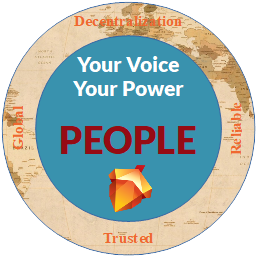
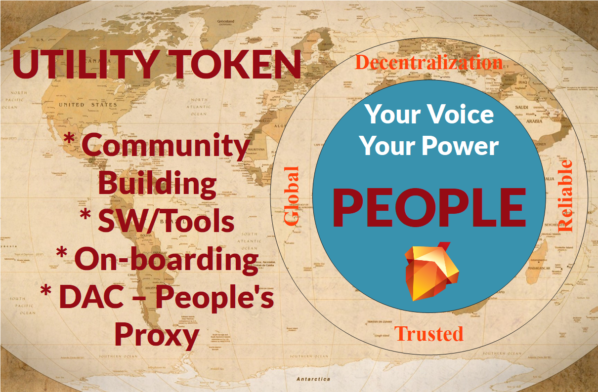

# PEOPLE (Utility Token)

  

The PEOPLE (Utility Token) is a multi-purpose token. It has been issued for multiple purposes, including, but not limited to:
* Community Building,
* Influence the behaviour of The People’s Proxy "**peoplesproxy**" to align with token holder's interests (**DAC**),
https://telos.bloks.io/account/peoplesproxy#votes
* Software/Tools Licensing, and
* On-boarding of new users on Telos Blockchain.
* Mass Market Adoption of Telos Blockchain Network (TBN)
https://www.telosfoundation.io/telos

It is The People's every day utility token.

It represents:
* **People's Voice**,
* **People's Sentiment**, and
* **People's Empowerment**.

https://vapaee.io/exchange/token/people

 

  

